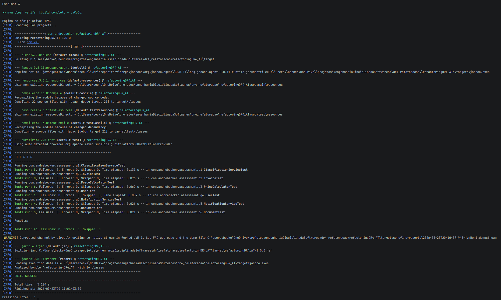
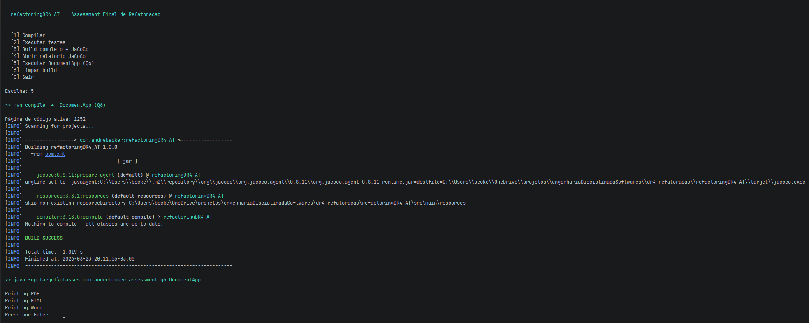
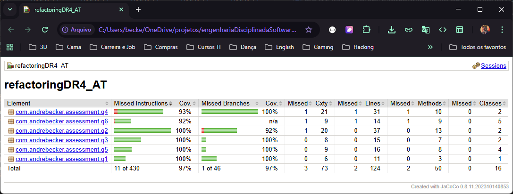

# Relatório Técnico — Assessment Final DR4

**Disciplina:** Refatoração — DR4
**Aluno:** André Luis Becker
**Instituto:** Infnet — Engenharia de Software — 2026

---

## Questão 1 — Refatoração prática de código simples

### Código legado

```java
public class X {
    public void y(int z) {
        if (z > 10) {
            System.out.println("ALTO");
        } else if (z == -9999) {
            System.out.println("CASO RARO");
        } else {
            System.out.println("BAIXO");
        }
        int temp = z * 0 + 42;
        System.out.println("DEBUG: z = " + z);
        if (z > 10 && z > 5) {
            System.out.println("ALTO");
        }
    }
}
```

### Bad smells identificados

**1. Nomes obscuros (Rename Method / Rename Variable)**
`X`, `y`, `z` são nomes que não carregam nenhuma informação sobre propósito. Quem lê o código precisa inferir a intenção da implementação — o oposto do que Clean Code prescreve. Nomes como `ClassificationService`, `printClassification` e `value` tornam o código autoexplicativo.

**2. Dead Code (Remove Dead Code)**
Três blocos sem propósito:
- `int temp = z * 0 + 42` — sempre resulta em 42, nunca usado
- `System.out.println("DEBUG: z = " + z)` — log de depuração esquecido
- `if (z > 10 && z > 5)` — condicional redundante; `z > 10` já implica `z > 5`, imprimindo "ALTO" uma segunda vez desnecessariamente

**3. Múltiplas responsabilidades / condicional duplicada**
O método original acumulava decisão de negócio e saída em um bloco linear sem separação clara. A extração de `classify()` separa decisão (retorna String) de exibição (`printClassification()` imprime), tornando `classify()` testável sem efeito colateral.

### Código refatorado

```java
public class ClassificationService {

    private static final int SPECIAL_CASE    = -9999;
    private static final int HIGH_THRESHOLD  = 10;

    public void printClassification(int value) {
        System.out.println(classify(value));
    }

    String classify(int value) {
        if (value == SPECIAL_CASE)    return "CASO RARO";
        if (value > HIGH_THRESHOLD)   return "ALTO";
        if (value == HIGH_THRESHOLD)  return "MÉDIO";
        return "BAIXO";
    }
}
```

O novo comportamento `MÉDIO` (valor == 10) foi inserido sem quebrar os demais — o caso especial `-9999` é verificado antes de qualquer comparação numérica, garantindo a precedência correta.

### Testes automatizados

```java
@Test
@DisplayName("valor acima de 10 é classificado como ALTO")
void valueAboveThresholdIsHigh() {
    assertThat(service.classify(11),  is("ALTO"));
    assertThat(service.classify(100), is("ALTO"));
}

@Test
@DisplayName("valor exatamente 10 é classificado como MÉDIO")
void valueAtThresholdIsMedium() {
    assertThat(service.classify(10), is("MÉDIO"));
}

@Test
@DisplayName("valor abaixo de 10 é classificado como BAIXO")
void valueBelowThresholdIsLow() {
    assertThat(service.classify(9),  is("BAIXO"));
    assertThat(service.classify(-1), is("BAIXO"));
}

@Test
@DisplayName("valor especial -9999 retorna CASO RARO antes de qualquer outra verificação")
void specialValueReturnsRareCase() {
    assertThat(service.classify(-9999), is("CASO RARO"));
}

@Test
@DisplayName("printClassification imprime a categoria no stdout")
void printClassificationWritesToStdout() {
    ByteArrayOutputStream out = new ByteArrayOutputStream();
    System.setOut(new PrintStream(out));
    service.printClassification(11);
    System.setOut(System.out);
    assertThat(out.toString().trim(), containsString("ALTO"));
}
```

Execução: `mvn test` — 5 testes, 0 falhas.

---

## Questão 2 — Identificando Bad Smells

### Bad smells encontrados (catálogo Fowler)

| # | Bad Smell | Categoria Fowler | Localização |
|---|-----------|-----------------|-------------|
| 1 | Campos públicos sem controle | Encapsulate Field | `clientName`, `clientEmail`, `amount`, `type` |
| 2 | Condicional duplicada | Duplicate Code | bloco `if (type == 1/2)` aparece duas vezes em `process()` |
| 3 | Código morto | Dead Code / Speculative Generality | `else if (type == -1)` — "nunca ocorre" |
| 4 | Bug lógico silencioso | — | `clientEmail == null && !...contains("@")` → NPE garantido |
| 5 | Método longo com múltiplas responsabilidades | Long Method / God Method | `process()` valida, formata e envia |
| 6 | Obsessão por primitivos | Primitive Obsession | `int type` sem semântica; aceita -1, 999, qualquer valor |
| 7 | Inveja de dados | Feature Envy | `process()` sabe demais sobre formatação do conteúdo do e-mail |
| 8 | Generalidade especulativa | Speculative Generality | caso `type == -1` presente mas nunca executado |

### Refatoração ilustrada: Primitive Obsession → enum

**Antes:**
```java
public int type;

if (type == 1) {
    System.out.println("Nota fiscal simples");
} else if (type == 2) {
    System.out.println("Nota fiscal com imposto");
} else if (type == -1) {
    // caso nunca ocorre
    System.out.println("Nota fiscal fantasma");
}
```

**Depois:**
```java
public enum InvoiceType {
    SIMPLE("Simples"),
    WITH_TAX("Com imposto");

    private final String label;
    InvoiceType(String label) { this.label = label; }
    public String label()     { return label; }
}
```

```java
private final InvoiceType type;

// uso:
System.out.println("Tipo: " + type.label());
```

O compilador passa a rejeitar valores inválidos. O caso `-1` ("nunca ocorre") deixa de existir porque o enum não o inclui. A string `"Simples"` ou `"Com imposto"` está no enum — único lugar onde deve estar.

### Testes automatizados

8 testes cobrindo: criação de `Invoice` válida, rejeição de nome em branco, e-mail nulo, e-mail inválido, valor negativo, tipo nulo, saída de `process()` e labels de `InvoiceType`.

---

## Questão 3 — Refatorando para legibilidade

### Código legado

```java
public double calculatePrice(double basePrice, int customerType, boolean holiday) {
    double discount = 0;
    if (customerType == 1) discount = 0.1;
    else if (customerType == 2) discount = 0.15;
    if (holiday) discount += 0.05;
    return basePrice * (1 - discount);
}
```

### Problemas de legibilidade

- `customerType == 1` e `== 2` são Magic Numbers sem semântica
- `holiday` como boolean nu: na chamada `calculatePrice(100, 1, true)` não é possível saber o que `true` significa sem ler a assinatura
- `discount` é acumulado em sequência linear — o leitor precisa rastrear o valor mentalmente
- `0.1` e `0.15` são constantes sem nome que explicam o que representam

### Código refatorado

```java
public enum CustomerType {
    STANDARD(0.10),
    PREMIUM(0.15),
    GUEST(0.0);

    private final double discountRate;
    CustomerType(double discountRate) { this.discountRate = discountRate; }
    public double discountRate()      { return discountRate; }
}

private static final double HOLIDAY_DISCOUNT = 0.05;

public double calculateFinalPrice(double basePrice, CustomerType customerType, boolean isHoliday) {
    double baseDiscount    = baseDiscountFor(customerType);
    double holidayDiscount = holidayDiscountWhenApplicable(isHoliday);
    double totalDiscount   = baseDiscount + holidayDiscount;
    return basePrice * (1 - totalDiscount);
}

private double baseDiscountFor(CustomerType customerType) {
    return customerType.discountRate();
}

private double holidayDiscountWhenApplicable(boolean isHoliday) {
    return isHoliday ? HOLIDAY_DISCOUNT : 0.0;
}
```

Técnicas aplicadas: **Introduce Explaining Variable** (`baseDiscount`, `holidayDiscount`, `totalDiscount`), **Replace Magic Number with Constant** (`HOLIDAY_DISCOUNT`), **Extract Method** (`baseDiscountFor`, `holidayDiscountWhenApplicable`), **Replace Primitive with Object** (`CustomerType` enum com taxa embutida).

### Testes automatizados

6 testes cobrindo todas as combinações `CustomerType` × `isHoliday`: STANDARD/PREMIUM/GUEST sem feriado e STANDARD/PREMIUM/GUEST com feriado. Valores verificados com `closeTo(expected, 0.001)`.

---

## Questão 4 — Refatorando para modularidade e encapsulamento

### Código legado

```java
public class User {
    public String name;
    public String email;
    public List addresses;
}
```

### Problemas

- Campos `public` permitem que qualquer código externo altere `name` e `email` diretamente, sem validação
- `List` sem `<T>` aceita qualquer objeto — erro detectável apenas em runtime ao fazer cast
- Sem método para adicionar endereços: o chamador manipula a lista diretamente, sem controle de consistência

### Código refatorado

**Address — Value Object imutável:**
```java
public final class Address {
    private final String street;
    private final String city;
    private final String zipCode;

    public Address(String street, String city, String zipCode) {
        // validação Fail-Fast
        this.street  = street;
        this.city    = city;
        this.zipCode = zipCode;
    }
    // apenas getters
}
```

**User — encapsulamento completo:**
```java
public final class User {
    private final String name;
    private final String email;
    private final List<Address> addresses = new ArrayList<>();

    public void addAddress(Address address) {
        addresses.add(address);
    }

    public List<Address> getAddresses() {
        return Collections.unmodifiableList(addresses);
    }
}
```

O encapsulamento protege a integridade porque: `name` e `email` só são definidos no construtor, com validação; a lista interna nunca vaza — `unmodifiableList()` impede que o chamador adicione ou remova elementos sem passar por `addAddress()`.

### Testes automatizados

15 testes: 8 para `User` (campos válidos, rejeição de nome/e-mail nulo e em branco, acumulação de endereços, rejeição de `addAddress(null)`, imutabilidade de `getAddresses()`) e 7 para `Address` (campos válidos, rejeição de logradouro/cidade/CEP nulo e em branco).

---

## Questão 5 — Refatorando condicional complexa com polimorfismo

### Código legado

```java
public void notifyUser(String channel, String message) {
    if (channel.equals("EMAIL")) {
        System.out.println("Sending EMAIL: " + message);
    } else if (channel.equals("SMS")) {
        System.out.println("Sending SMS: " + message);
    } else if (channel.equals("PUSH")) {
        System.out.println("Sending PUSH: " + message);
    }
}
```

### Código refatorado

```java
public interface NotificationChannel {
    void send(String message);
}

public final class EmailChannel implements NotificationChannel {
    public void send(String message) {
        System.out.println("Sending EMAIL: " + message);
    }
}

// SmsChannel e PushChannel — estrutura idêntica

public final class NotificationService {
    private final NotificationChannel channel;

    public NotificationService(NotificationChannel channel) {
        this.channel = channel;
    }

    public void notifyUser(String message) {
        channel.send(message);
    }
}
```

**OCP aplicado:** `NotificationService` está fechado para modificação. Um novo canal (`WhatsAppChannel`) é apenas uma nova implementação de `NotificationChannel` — sem alteração nas classes existentes.

**LSP verificado:** qualquer implementação de `NotificationChannel` pode substituir outra sem alterar o comportamento observável de `notifyUser()`.

### Testes automatizados

4 testes: `EmailChannel`, `SmsChannel` e `PushChannel` verificados via `ByteArrayOutputStream`; construtor de `NotificationService` rejeita canal nulo com `IllegalArgumentException`.

---

## Questão 6 — Substituindo tipos por hierarquias e melhorando coesão

### Código legado

```java
public class Document {
    public String type;

    public void print() {
        if (type.equals("PDF")) {
            System.out.println("Printing PDF");
        } else if (type.equals("HTML")) {
            System.out.println("Printing HTML");
        } else {
            System.out.println("Unknown format");
        }
    }
}
```

### Problemas da abordagem com type code

1. **Ausência de segurança de tipos** — `type = "pdf"` e `type = "PDF"` produzem resultados distintos sem aviso
2. **OCP violado** — adicionar "WORD" exige modificar `Document` e potencialmente todos os locais que testam o campo `type`
3. **Baixa coesão** — `Document` conhece o comportamento de todos os formatos possíveis
4. **Else silencioso** — `type` desconhecido imprime "Unknown format" sem nenhuma evidência no sistema de tipos

### Código refatorado

```java
public abstract class Document {
    public abstract void print();
}

public final class PdfDocument extends Document {
    public void print() { System.out.println("Printing PDF"); }
}

public final class HtmlDocument extends Document {
    public void print() { System.out.println("Printing HTML"); }
}

public final class WordDocument extends Document {
    public void print() { System.out.println("Printing Word"); }
}
```

### Main — demonstração do polimorfismo

```java
public class DocumentApp {
    public static void main(String[] args) {
        List<Document> documents = List.of(
            new PdfDocument(),
            new HtmlDocument(),
            new WordDocument()
        );
        documents.forEach(Document::print);
    }
}
```

**Saída esperada:**
```
Printing PDF
Printing HTML
Printing Word
```

**Por que esta abordagem melhora o design:**
- **Coesão:** cada subclasse sabe exatamente como imprimir seu formato e nada mais
- **DRY:** a lógica de despacho por tipo não existe mais — o polimorfismo a elimina
- **OCP:** `MarkdownDocument` seria uma nova classe; `Document`, `PdfDocument` e `HtmlDocument` permanecem intactos
- **Testabilidade:** cada `Document` pode ser instanciado e testado isoladamente sem depender de um campo `type` que precisa ser configurado manualmente

### Testes automatizados

5 testes: `PdfDocument`, `HtmlDocument` e `WordDocument` verificados individualmente; dispatch polimórfico com três subclasses via referência `Document`; `DocumentApp.main()` verifica os três formatos em sequência.

---

## Evidências de Execução

### Build completo + JaCoCo — `mvn clean verify`



### Saída do DocumentApp — Q6



### Relatório de cobertura JaCoCo



---

## Referências

- MARTIN, Robert C. *Clean Code: A Handbook of Agile Software Craftsmanship*. 2. ed. Prentice Hall, 2008.
- FOWLER, Martin. *Refactoring: Improving the Design of Existing Code*. 2. ed. Addison-Wesley, 2018.
- BECK, Kent. *Test Driven Development: By Example*. Addison-Wesley, 2002.
